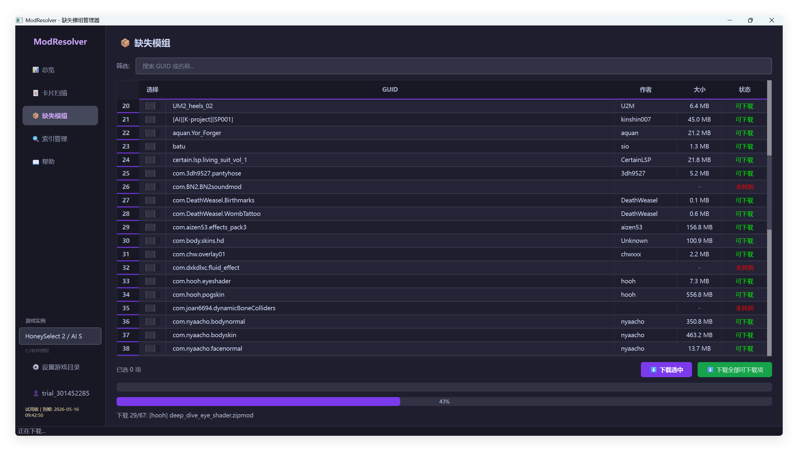

# ModResolver 🔑

 

[中文](README.md) · [English](README_EN.md) · [日本語](README_JA.md)

> Precise missing mod resolver for HoneySelect2 / Koikatsu

Still manually searching BetterRepack for missing mods? Getting frustrated by cards showing missing content?

**ModResolver** automatically identifies missing mods from your cards and resolves them with one click — no more blind downloads.

---

## ✨ Key Features

### 🎯 100% Precise Matching — No More Guessing
Using HTTP Range Request technology, ModResolver fetches only the manifest.xml (a few KB) from remote zipmods and reads mod GUIDs directly — **not fuzzy filename matching, but exact mod identifier matching** with 100% accuracy. Automatically parses mod dependencies from character cards, outfit cards, and scene cards, compares with your local mods, and **downloads only what you're actually missing**.

### ⚡ Lightning-Fast Indexing — 10,000+ Mods in Minutes
No need to download entire zipmods — only extract key info from manifest.xml to build the index. 200 concurrent threads for indexing, 12,000+ mods processed in minutes. Incremental indexing only handles new or changed mods.

### 📥 One-Click Resolve — Easy & Safe
Select missing mods and batch download with one click. Downloads are stored in an isolated directory — your original mods folder stays clean.

### 🖥️ Modern UI — Intuitive & Clean
Dark theme UI, card category browsing, missing mod TOP10 ranking, real-time download progress — everything at your fingertips.

---

## 🎮 Supported Games

| Game | Index Scope |
|------|-------------|
| HoneySelect 2 / AI Shoujo | AISHS2 |
| Koikatsu / EmotionCreators | KKEC |

---

## 💎 Editions

ModResolver **Free Edition includes all features** — no functionality is cut, no time limit.

The Paid Edition offers a more efficient experience and long-term support:

| | Free | 💎 Paid |
|------|:----:|:-------:|
| Card scanning & browsing | ✅ | ✅ |
| Missing mod detection | 1 card at a time | ✅ Unlimited batch |
| Mod download | 1 at a time | ✅ Unlimited batch |
| Download concurrency | 1 thread | ✅ 4 threads |
| Index building | 5 threads | ✅ 200 threads |
| Crawl concurrency | 2 threads | ✅ 50 threads |
| Missing TOP10 ranking | ✅ | ✅ |
| Incremental indexing | ✅ | ✅ |
| Free trial on first launch | ✅ | — |
| Priority tech support | — | ✅ |
| Long-term updates | — | ✅ |

> 💡 The Free Edition is fully functional with a free trial on first launch. The Paid Edition unlocks unlimited batch operations and maximum speed.

---

## 🛒 Get the Paid Edition

**29.9 CNY — One-time purchase, lifetime use** — Support ongoing development 👉 [Purchase on Afdian](https://afdian.com/a/xrmpc?tab=shop)

After purchase, click "Activate" in the app → enter your license key → unlock instantly.

---

## 🚀 Quick Start

1. Download the latest `ModResolver.exe`
2. Double-click to run — free trial is applied automatically on first launch
3. Set your game directory → Build index → Scan cards → One-click resolve

It's that simple.

---

## 📂 Data Storage

All data is stored in `ModResolver/.modresolver/` next to the exe. Delete the folder to clean up — no leftovers.

---

## ❓ FAQ

**Q: Is the Free Edition usable?**
A: Absolutely! The Free Edition includes all features — only batch operations and concurrency are limited. Single card detection and single mod download work without restrictions.

**Q: Will downloaded mods overwrite my existing mods?**
A: No. Downloads go to the `ModResolver_Downloads` subdirectory — completely isolated from your mods folder.

**Q: Which games are supported?**
A: HoneySelect 2 / AI Shoujo and Koikatsu / EmotionCreators.

**Q: How long does indexing take?**
A: With the Paid Edition's 200 threads, 12,000+ mods typically take 3-5 minutes. The Free Edition's 5 threads are slower but still functional.

**Q: Is the Paid Edition worth it?**
A: If you have many cards to resolve, the 200-thread indexing and unlimited batch downloads save significant time. Your support also drives continued updates and improvements.

---

🔗 [Afdian](https://afdian.com/a/xrmpc?tab=shop) · [Documentation](https://docs.xrmsoft.com/)
